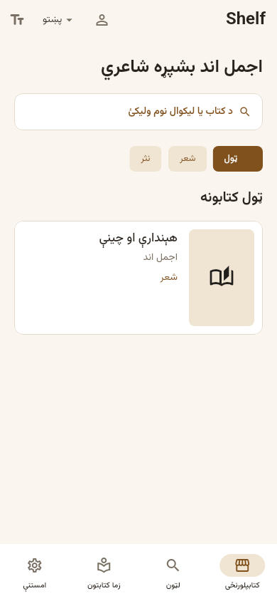
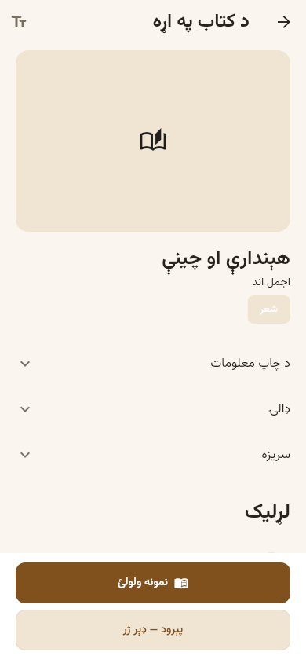
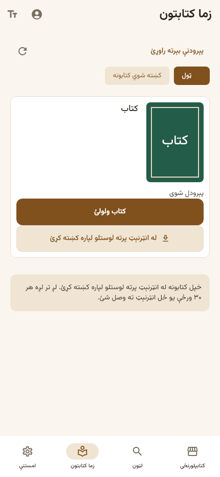
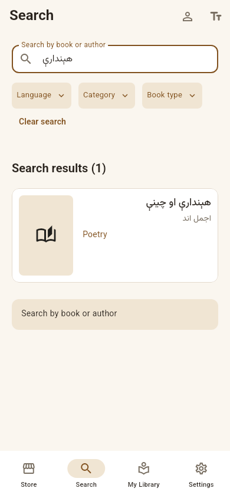
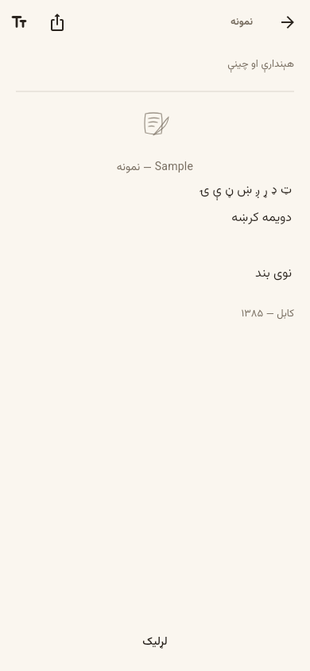
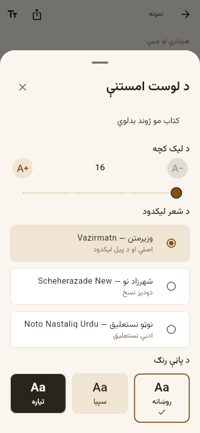
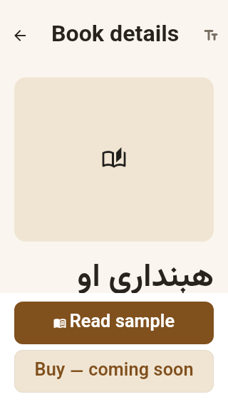
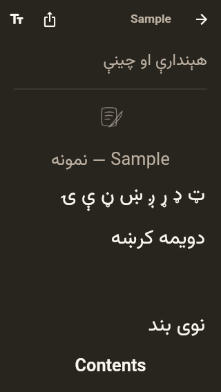
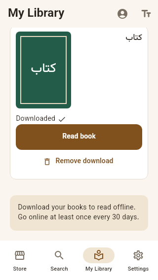

# Review the shared Shelf UI

These are Flutter test renders of the implemented UI. Test text and cover
fallbacks are synthetic; the app still uses original catalogue content/covers.
Android phone acceptance and iOS validation remain pending. No deployment or
release build was made. [Implementation evidence](FIGMA_REVIEW_2_IMPLEMENTATION.md).

## Store — Pashto

## Book details — Pashto

## My Library — Pashto

## Search — English

## Reader — Pashto

## Reading preferences — Pashto

## Small screen with enlarged text

## Downloaded book — English

